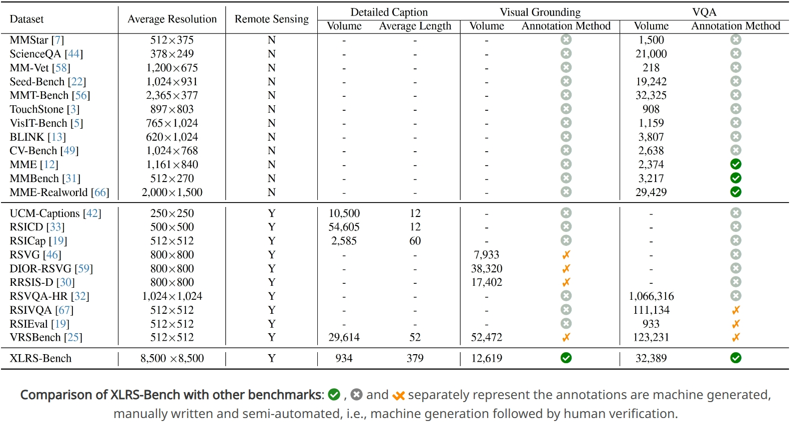
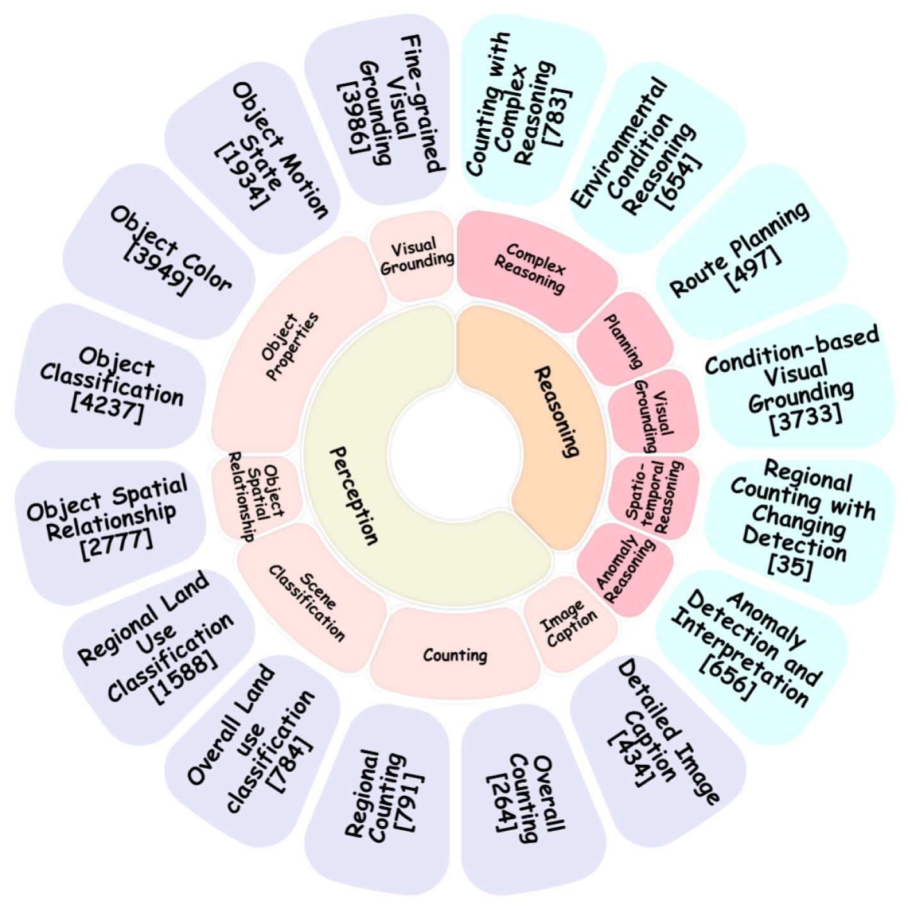
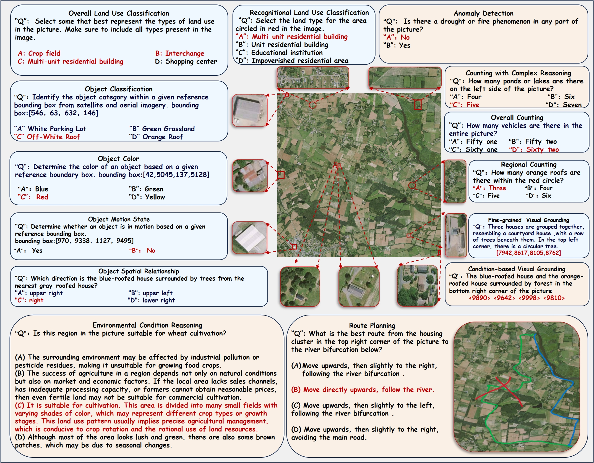
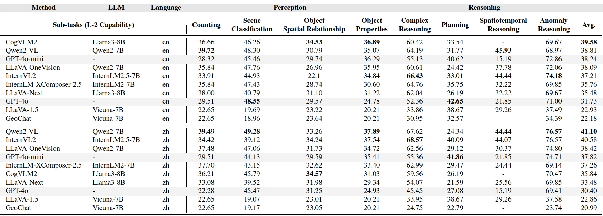
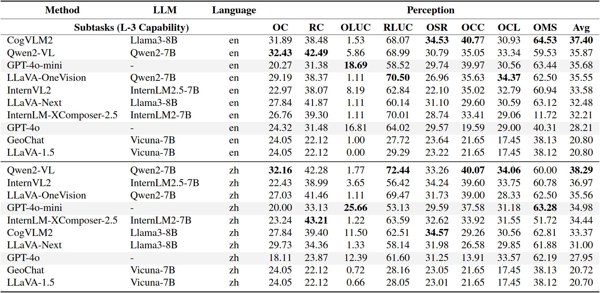
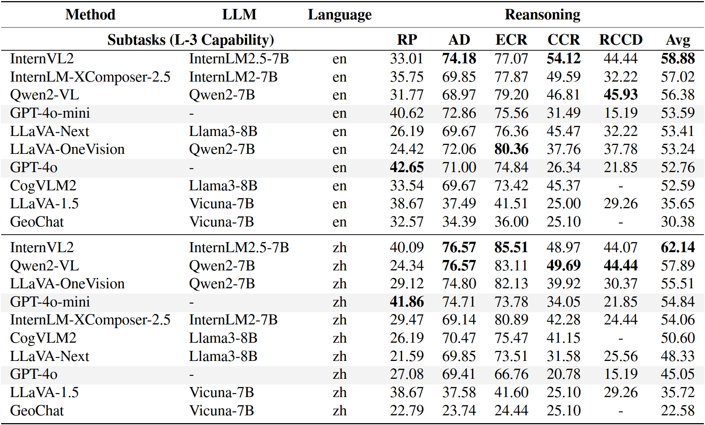
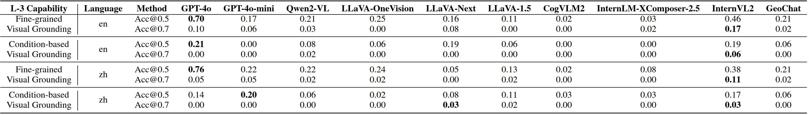

<div align="center" >
<h2 class="subtitle is-3 publication-subtitle ", style="width: 100%;margin-bottom: 20px;">
            <strong>Could Your Multimodal LLMs Understand Extremely Large
              Ultra-High-Resolution Remote Sensing Imagery?</strong>
          </h2>
<div class="is-size-5 publication-authors", style="width: 100%; margin: 15px auto;", >
            <span class="author-block">Fengxiang Wang<sup style="color:#18acfb;">1</sup> ,</span>
            <span class="author-block">Hongzhen Wang<sup style="color:#9400D3">2</sup>,</span>
            <span class="author-block">Zonghao Guo<sup style="color:#9400D3">2</sup>,</span>
            <span class="author-block">Di Wang<sup style="color:#ed4b82">3</sup><sup>,</sup><sup style="color:#1a4ebf">5</sup>,</span>
            <span class="author-block">Yulin Wang<sup style="color:#9400D3">2</sup>,</span>
            <span class="author-block">Mingshuo Chen<sup style="color:#ffac33">4</sup>,</span> <br>
            <span class="author-block">Qiang Ma<sup style="color:#9400D3">2</sup>,</span>
            <span class="author-block">Long Lan<sup style="color:#18acfb;">1</sup> ,</span>
            <span class="author-block">Wenjing Yang<sup style="color:#18acfb;">1</sup><sup>*</sup> ,</span>
            <span class="author-block">Jing Zhang<sup style="color:#ed4b82">3</sup><sup>,</sup><sup style="color:#6fbf73">6</sup>,</span>
            <span class="author-block">Zhiyuan Liu<sup style="color:#9400D3">2</sup>,</span>
            <span class="author-block">Maosong Sun<sup style="color:#9400D3">2</sup></span>
        </div>      <div class="is-size-5 publication-authors">
        <span class="author-block"><sup style="color:#53bcf5">1</sup>College of Computer Science and Technology, National University of Defense Technology,</span>
        <span class="author-block"><sup style="color:#9400D3">2</sup>Tsinghua University,</span> <br>
        <span class="author-block"><sup style="color:#ed4b82">3</sup>School of Computer Science, Wuhan University,</span>
        <span class="author-block"><sup style="color:#ffac33">4</sup>Beijing University of Posts and Telecommunications,</span> <br>
        <span class="author-block"><sup style="color:#1a4ebf">5</sup>Zhongguancun Academy,</span>
        <span class="author-block"><sup style="color:#6fbf73">6</sup>School of Artificial Intelligence, Wuhan University</span><br>
    </div></div>
<div align='center' style="font-size: large; "><strong>CVPR 2025</strong></div>

<div align='center' >[<a href="https://XLRS-Bench.github.io/">🍎 Project Page</a>]
[<a href="https://arxiv.org/abs/25xx.xxxxx">📖 arXiv Paper</a>]
[<a href="https://huggingface.co/datasets/initiacms/XLRS-Bench">🤗 Dataset</a>]
[<a href="https://XLRS-Bench.github.io/home_page.html#leaderboard">🏆 Leaderboard</a>]</div>


# 🔥News

* **`2025.02.27`**: XLRS-Bench has been accepted by CVPR 2025!

# 📚Contents

- [🔥News](#news)
- [📚Contents](#contents)
- [🔍Dataset Overview](#dataset-overview)
- [📸Dataset Examples](#dataset-examples)
- [📜Dataset License](#dataset-license)
- [🚀Evaluation Pipeline](#evaluation-pipeline)
  - [Prompt](#prompt)
  - [Evaluation](#evaluation)
  - [Leaderboard](#leaderboard)
- [📊Experiment Results](#experiment-results)
- [📖Citation](#citation)
- [🙏Acknowledgement](#acknowledgement)
- [📚Contact](#contact)

# 🔍Dataset Overview

<p align="center"> </p>

Remote sensing (RS) images have become essential for monitoring and understanding human environments, driving advancements in applications like precision agriculture, urban planning, and disaster assessment. While recent studies have proposed benchmarks and metrics to assess MLLM performance in RS, these efforts remain limited in image size, annotation method and evaluation dimensions.
​We present XLRS-Bench, **a comprehensive benchmark for evaluating the perception and reasoning capabilities of MLLMs in ultra-high-resolution RS scenarios,** featuring the largest average image size of **8,500 × 8,500** observed thus far. Our dataset encompasses **45,942 annotations across 16 tasks**, all expertly curated by a team of 45 experts. The main advantages of XLRS-Bench compared to existing MLLM benchmarks as follows:

1. **Ultra-high Resolution.** XLRS-Bench features the largest image sizes available, **10∼20×** than that of existing datasets, with 840 images out of all images at a resolution of **10,000×10,000** pixels
2. **High-quality Annotation.** All the annotations are human involved and manually verified through iterations, resulting in a high-quality benchmark for evaluating MLLMs on real ultra-high-resolution RS scenarios.
3. **Comprehensive Evaluation Dimensions:** XLRS-Bench covers 10 perception indicators and 6 reasoning dimensions to assess MLLMs’ capabilities, encompassing **16 sub-tasks with a total of 45,942** questions. Especially, XLRS-Bench includes complex reasoning tasks to explore MLLMs’ potential in conducting planning and change detection in long spatial-temporal RS scenarios.

<p align="center"></p>

# 📸Dataset Examples



# 📜Dataset License

Annotations of this dataset is released under a [Creative Commons Attribution-NonCommercial 4.0 International License](http://creativecommons.org/licenses/by-nc-sa/4.0). For images from:

- **[DOTA](https://captain-whu.github.io/DOTA)**  
  RGB images from Google Earth and CycloMedia (for academic use only; commercial use is prohibited, and Google Earth terms of use apply).

- **[ITCVD](https://phys-techsciences.datastations.nl/dataset.xhtml?persistentId=doi:10.17026/dans-xnc-h2fu)**  
  Licensed under [CC-BY-NC-SA-4.0](http://creativecommons.org/licenses/by-nc-sa/4.0).

- **[MiniFrance](https://ieee-dataport.org/open-access/minifrance), [HRSCD](https://ieee-dataport.org/open-access/hrscd-high-resolution-semantic-change-detection-dataset)**  
  Released under [IGN’s "licence ouverte"](https://web.archive.org/web/20200717042533/http://www.ign.fr/institut/activites/lign-lopen-data).

- **[Toronto, Potsdam](https://www.isprs.org/education/benchmarks/UrbanSemLab/default.aspx):**  
  The Toronto test data images are derived from the Downtown Toronto dataset provided by Optech Inc., First Base Solutions Inc., GeoICT Lab at York University, and ISPRS WG III/4, and are subject to the following conditions:
  1. The data must not be used for other than research purposes. Any other use is prohibited.
  2. The data must not be used outside the context of this test project, in particular while the project is still on-going (i.e. until September 2012). Whether the data will be available for other research purposes after the end of this project is still under discussion.  
  3. The data must not be distributed to third parties. Any person interested in the data may obtain them via ISPRS WG III/4.
  4. The data users should include the following acknowledgement in any publication resulting from the datasets: 
     “*The authors would like to acknowledge the provision of the Downtown Toronto data set by Optech Inc., First Base Solutions Inc., GeoICT Lab at York University, and ISPRS WG III/4.*”  

**Disclaimer:**  
If any party believes their rights are infringed, please contact us immediately at **[wfx23@nudt.edu.cn](mailto:wfx23@nudt.edu.cn)**. We will promptly remove any infringing content.

# 🚀Evaluation Pipeline

## Prompt

The common prompt used in **VQA** follows this format:

```
[Image] [Question] The choices are listed below:
(A) [Choice A]
(B) [Choice B]
(C) [Choice C]
(D) [Choice D]
Select the best answer for the multiple-choice question based on the image. Only respond with the letter corresponding to the correct answer (A, B, C, D).
The answer is:
```

or for **VQA task Overall Land Use Classification** please use:

```
Select the best answer(s) for the multiple-choice question based on the image. There may be more than one correct option. Only respond with the letter(s) corresponding to the correct answer(s) (A, B, C, D), with multiple choices separated by spaces.
```

For Visual Grounding and Detailed Image Captioning, please refer to our source files in the **evaluation** folder.

## Evaluation

**As soon as our dataset is released**, XLRS-Bench will be integrated with [lmms-eval](https://github.com/EvolvingLMMs-Lab/lmms-eval), allowing you to evaluate models easily through this framework

## Leaderboard

To add your model to our [leaderboard](https://XLRS-Bench.github.io/home_page.html#leaderboard), please send your model responses to **[wfx23@nudt.edu.cn](mailto:wfx23@nudt.edu.cn)**. Refer to the `evaluation/samples` folder for the required format.

# 📊Experiment Results

Models are ranked based on their average performance. Proprietary models are highlighted in gray. Task domains are indicated by abbreviations (e.g., “OC” for Overall Counting, “RC” for Regional Counting, etc.).

* **L-2 performance on VQA tasks.**
  
  
  
* **L-3 perception dimension on VQA tasks.**
  

* **L-3 reasoning dimension on VQA tasks.**

  

* **Visual grounding performance.**

  

* **Detailed image captioning performance.**

  

# 📖Citation

If you find our work helpful, please consider citing:

```tex
@article{wang2025xlrsbench,
    title={XLRS-Bench: Could Your Multimodal LLMs Understand Extremely Large Ultra-High-Resolution Remote Sensing Imagery?},
    author={Wang, Fengxiang and Wang, Hongzhen and Chen, Mingshuo and Wang, Di and Wang, Yulin and Guo, Zonghao and Ma, Qiang and Lan, Long and Yang, Wenjing and Zhang, Jing and others},
    journal={arXiv preprint arXiv:25xx.xxxxx},
    year={2025}
}
```

# 🙏Acknowledgement

* [MME-RealWorld] [MME-RealWorld: Could Your Multimodal LLM Challenge High-Resolution Real-World Scenarios that are Difficult for Humans?](https://github.com/yfzhang114/MME-RealWorld)

# 📬Contact

For any other questions please contact:

* Fengxiang Wang at [wfx23@nudt.edu.cn](mailto:wfx23@nudt.edu.cn)
* Mingshuo Chen at [chen.mingshuo@bupt.edu.cn](mailto:chen.mingshuo@bupt.edu.cn)
